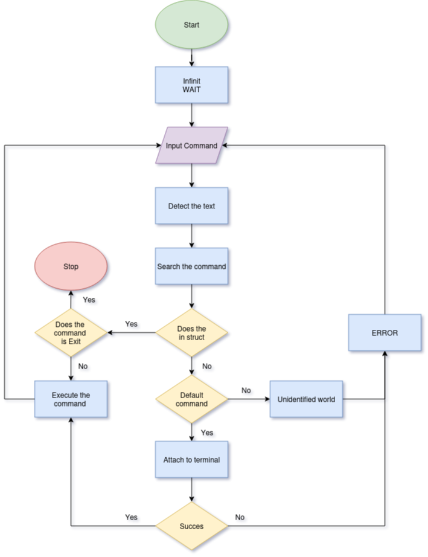

# README of the project Simple Shell

    

<!-- markdownlint-disable-line MD033 -->

## 📖 Description

Simple Shell is a C implementation of a basic command interpreter, inspired by the Unix shell.
The project aims to teach and practice:
* the inner workings of a command interpreter,
* process creation and management (`fork`, `execve`, `wait`, etc.),
* the use of environment variables and the `$PATH`,
* input/output and stream management,
* UNIX return code conventions.

The program allows you to:

* Display a prompt and wait for a user command.
* Execute programs located in the current directory or in the `$PATH`.
* Manage simple commands with arguments.
* Provide a compliant exit code.

This project was developed as part of the Holberton School peer programming curriculum, to deepen your understanding of systems programming and collaboration on a low-level project.

## 🧭 Index

1 - [⚙️ Cloning and Compilation](#️-cloning-and-compilation)\
2 - \
3 - [📚 Files in Repository](#-files-in-repository)\
4 - [📄 Man Page](#-man-page)\
5 - [🗺️ Flowchart](#%EF%B8%8F-flowchart)\
6 - [🧪 Tests and outputs](#-tests-and-output)\
7 - [📁 Project Structure](#-project-structure)\
8 - [👥 Authors](#-authors)\
9 - [📜 License](#-license)

## ⚙️ Cloning and Compilation

### ✅ Prerequisites

**GCC** installed on your system.\
**Ubuntu 20.04 LTS** (or equivalent).

### 📥 Clone and execution

| Task |Command|
|--------------------------------------------|-------------------------------------------------------|
| `Clone repo` | `git clone https://github.com/CecileLAROCHE/holbertonschool-simple_shell.git` |
| `Compile` | `gcc -Wall -Werror -Wextra -pedantic -std=gnu89 *.c -o hsh` |
| `Run shell:` | `./hsh` |

## 🚀 Features / Limitations

### ✅ Features
- Displays a prompt and waits for user input.
- Executes commands found in the current directory or in the `$PATH`.
- Supports command arguments.
- Handles environment variables (custom `_getenv` and `print_env`).
- Man page available (`man ./man_1_simple_shell`).
- Interactive **and** non-interactive modes.

### ⚠️ Limitations
- No support for advanced shell features (pipes `|`, redirections `>`, `<`, `>>`, `<<`, etc.).
- No job control (`&`, background processes, `fg`, `bg`).
- No shell scripting (`if`, `while`, `for`, etc.).
- Error handling is basic compared to full-featured shells.
- Limited set of built-in commands (only those implemented in this project).

## 📚 Files in Repository

### 🖥️ Source Code Files

| File                   | Description                                                                                         |
| ---------------------- | --------------------------------------------------------------------------------------------------- |
| `shell.h`              | Header file containing function prototypes, macros, and struct definitions used across the project. |
| `main.c`               | Entry point of the shell, initializes the program and starts the main loop.                         |
| `read_line.c`          | Handles user input by reading a line from standard input.                                           |
| `process_command.c`    | Parses the input line into tokens and prepares the command for execution.                           |
| `print_env.c`          | Prints the current environment variables.                                                           |
| `execute_command.c`    | Handles the execution of built-in and external commands.                                            |
| `_getenv.c`            | Custom implementation of `getenv`, retrieves environment variables.                                 |
| `_find_path_command.c` | Finds the absolute path of a command by searching in the `PATH` environment variable.               |

### 📑 Documentation Files

| File                 | Description                                                       |
| -------------------- | ----------------------------------------------------------------- |
| `man_1_simple_shell` | Manual page describing usage, options, and behavior of the shell. |
| `README.md`          | Main project documentation (this file).                           |
| `AUTHORS`            | List of project contributors.                                     |

## 📋 Man page
This project contains a man page in the repository files. You can directly run it in the shell doing : `man ./man_1_simple_shell`

## 🗺️ Flowchart

## 🧪 Tests and Outputs

#### test terminal :

#### test interactiv mod :

#### test uninteractiv mod :

## 📁 Project Structure

| 📂 Directory / File | 📝 Description |
|---------------------|----------------|
| **Picture/** | Documentation assets (images for README) |
| ├── Flowchart.png | Execution flowchart |
| ├── terminal.png | Example of interactive mode |
| ├── ls.png | Example of `ls` command |
| ├── ls_-l.png | Example of `ls -l` command |
| ├── cat_print_env.png | Example of `cat` with printenv |
| ├── uninteractive_mod_echo.png | Non-interactive mode example (echo) |
| └── uninteractive_mod_error.png | Non-interactive mode error example |
| **AUTHORS** | List of contributors |
| **README.md** | Main project documentation |
| **man_1_simple_shell** | Manual page for the shell |
| **shell.h** | Header file with prototypes and macros |
| **main.c** | Entry point, initializes the shell |
| **read_line.c** | Reads user input from stdin |
| **process_command.c** | Parses and tokenizes the command line |
| **print_env.c** | Prints environment variables |
| **execute_command.c** | Executes built-in and external commands |
| **_getenv.c** | Custom getenv implementation |
| **_find_path_command.c** | Locates command in PATH directories |

## 👥 Authors

This project was collaboratively developed by Holberton students as a peer programming exercise.\
\
**Esteban LEVY** [GitHub](https://github.com/ST-GuY)\
**Thomas SORLI** [GitHub](https://github.com/Pendarium)\
**Cécile LAROCHE** [GitHub](https://github.com/CecileLAROCHE)

## 📜 License

This project is for educational purposes only as part of Holberton School.
